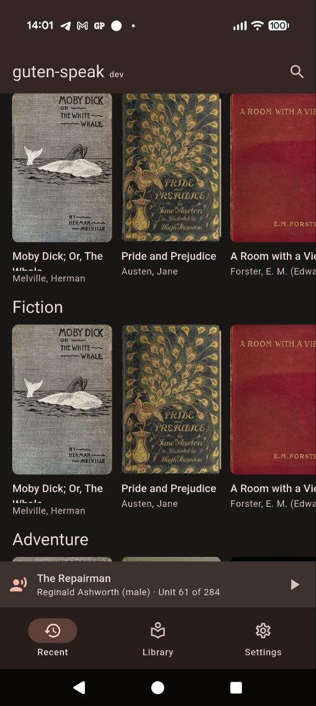
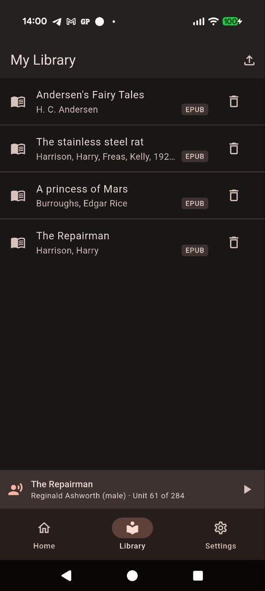
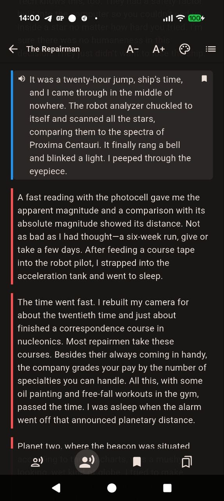
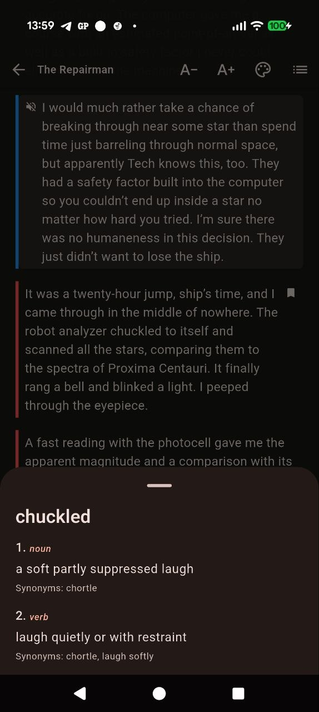
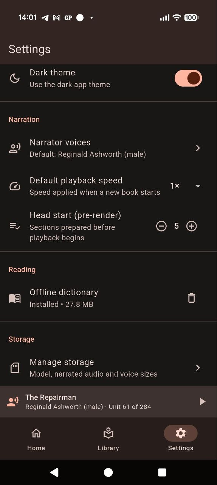

# Guten-Speak — read & listen to Project Gutenberg

**Guten-Speak** is an Android-first Flutter app that turns [Project
Gutenberg](https://www.gutenberg.org/) into a personal audiobook library. Search
for public-domain books, download them, **read** them in a clean e-reader, and —
optionally — have them **narrated aloud in a voice you cloned yourself**, entirely
on-device.

**Screenshots:**

<a href="screenshots/home-page.jpeg"></a>
<a href="screenshots/library-page.jpeg"></a>
<a href="screenshots/voice-narration.jpeg"></a>
<a href="screenshots/dictionary.jpeg"></a>
<a href="screenshots/settings-page.jpeg"></a>

**Watch a demo:** [DEMO](https://youtu.be/2bANlGBUbDw?si=IgdIExeEnggg8aVN) 

**Read _or_ listen.** Guten-Speak is a fully usable plain e-reader on its own.
Narration is an **opt-in** mode layered on top — you never have to download the
speech model or clone a voice if you just want to read.
  
**On-device & offline-first.** Once a book is downloaded (and a stretch is
synthesized), reading _and_ listening work with no network.
  
**Free and open-source.** Cloned voices stay local to your device.

**guten-speak** has been verified to work on: `Pixel 10 Pro`, `Pixel 7 Pro`, `Samsung Galaxy S8`.

---

## Features

- **Discover** popular and curated-topic books via the Gutendex API.
- **Offline search & book detail** from an on-device index of Project
  Gutenberg's `pg_catalog.csv` (~80k English texts), so search works without
  relying on a live API.
- **Download manager** (resumable, with Gutenberg boilerplate stripping) that
  stores books locally; to make it possible to read books in EPUB format coming
  from other sources (no DRM support atm).
- **E-reader** with lazy rendering, index-precise resume/jump, a heuristic table
  of contents, multiple reading themes (Light / Sepia / Dark / AMOLED),
  typography controls, and auto-hiding chrome.
- **Bookmarks** — save multiple positions per book, jump back to any of them from
  a list beside the table of contents, with an in-text marker on bookmarked
  paragraphs.
- **Dictionary** A dictionary exist for looking up the meaning of a word (only English atm).
- **Voice library** — import your own `.wav` samples (named, persisted) plus two
  bundled built-in voices (Reginald Ashworth & Deja Thoris).
- **On-device narration** — zero-shot voice cloning + text-to-speech running in a
  background worker isolate, with a bounded **head-start pre-render** so playback
  stays ahead of synthesis.
- **Background player** — lock-screen / notification controls, audio focus &
  ducking, skip ±section, variable speed (0.75×–2×), a persistent mini-player,
  and resume-where-you-left-off.
- **Reader ↔ narration sync** — the current paragraph is highlighted and scrolled
  into view while playing; tap any paragraph to seek narration there.
- **App theming** — dark (default) / light, persisted across launches.

---

## How it works

### Access to Project Gutenberg

Project Gutenberg does not offer a modern REST API, but it publishes catalog
dumps and predictable download URLs. Guten-Speak uses two complementary paths:

1. **Gutendex** ([https://gutendex.com](https://gutendex.com)) — a free, no-auth
   REST API over Gutenberg's catalog — powers the **Discover** screen (popular +
   curated topics).

   ```
   GET https://gutendex.com/books?search=dickens%20great
   GET https://gutendex.com/books?topic=fiction&languages=en
   GET https://gutendex.com/books/1342
   ```

2. **Offline local catalog** — for reliable search and book detail, Guten-Speak
   downloads Gutenberg's `pg_catalog.csv` once (~21 MB), parses it off the UI
   isolate, and indexes it into a local SQLite table. Search then runs entirely
   on-device.

Book text is fetched directly from Gutenberg's standard URL paths, e.g. the
UTF-8 plain text for book #84 (_Frankenstein_):

```
https://www.gutenberg.org/ebooks/84.txt.utf-8
```

### Text to speech (on-device voice cloning)

Narration is powered by
**[Pocket TTS Raven](https://github.com/etnt/pocket-tts-raven)**, an
on-device engine running Kyutai's **Pocket TTS** zero-shot cloning model (int8,
4-step flow). From a short `.wav` sample it clones a voice and synthesizes book
text — no cloud, no account, no per-request cost. Synthesis runs in a persistent
worker isolate to keep the UI responsive.

To keep playback smooth and gap-free (and to stay ahead on slower devices),
Guten-Speak pre-renders a bounded **head start** into a rolling audio cache
before playback begins and keeps topping it up as the play head advances. When
playback catches up to the synthesized frontier it stops cleanly and lets you
choose how much to prepare next — no garbled audio.

> **Model download is opt-in.** The Pocket TTS Raven model (~80 MB download,
> ~165 MB on disk) is only downloaded the first time you tap **Listen**, behind
> a consent + storage-space gate.

> **Narration is experimental.** Zero-shot cloning quality varies with the sample
> you provide, and the app pre-renders audio rather than streaming it live.
> Expect the occasional artifact and treat narration as a preview feature — the
> plain e-reader is the stable core.

---

## Tech stack

| Area             | Package / Tool                              |
|------------------|---------------------------------------------|
| Framework        | Flutter (stable) / Dart 3.x — Android first |
| State management | `flutter_riverpod` + `riverpod_annotation` (codegen) |
| Routing          | `go_router` (stateful shell + bottom nav) |
| Networking       | `dio` (catalog/detail, downloads) + `http` (model download) |
| Storage          | `sqflite` (books, progress, bookmarks, synth-cache index) + `shared_preferences` |
| On-device TTS    | `pocket_tts_raven` (local FFI plugin: Pocket TTS Raven engine + ONNX Runtime; int8, 24 kHz) |
| Voice import     | `file_picker`; archive extraction via `archive` |
| Audio playback   | `just_audio` + `audio_service` (background, lock-screen) |
| Reader           | `scrollable_positioned_list` (index-precise scrolling) |
| Codegen          | `build_runner`, `freezed`, `json_serializable`, `riverpod_generator` |
| Testing / CI     | `flutter_test`, `integration_test`, `mocktail`, GitHub Actions |

The app lives under [app/](app); the architecture is feature-first
(`catalog`, `library`, `reader`, `voices`, `narration`, `settings`) with shared
TTS infrastructure under `core/tts/`.

---

## Getting started

Requirements: the Flutter SDK (stable channel) and an Android device/emulator.
Narration additionally needs an arm64 device with room for the ~165 MB model.

```bash
cd app
flutter pub get

# Regenerate Riverpod/Freezed/JSON code after touching annotated sources:
dart run build_runner build --delete-conflicting-outputs

# Run on a connected device:
flutter run

# Static analysis + tests:
flutter analyze
flutter test
```

The header on the Discover screen shows the app version: `dev` for local/debug
builds, or the release tag (e.g. `v1.0.0`) for CI-built release APKs. See below.

---

## Release signing

Release APKs are signed with a persistent keystore so that updates install over
previous versions without conflicts. The key is stored as GitHub Actions secrets
and decoded at build time by [.github/workflows/release.yml](.github/workflows/release.yml),
which is triggered by pushing a `v*` tag and passes the tag through as the visible
app version (`--dart-define=APP_VERSION=<tag>`).

Locally, when `key.properties` is absent, the release build falls back to the
debug signing key — so `flutter build apk --release` still works for testing.

**One-time setup:**

1. Generate the keystore (run from the `app/` directory). Keep the file safe and
   out of git — if you lose it you can no longer ship updates that install over
   existing installs.

   ```bash
   keytool -genkey -v \
     -keystore android/release-keystore.jks \
     -keyalg RSA -keysize 2048 -validity 10000 \
     -alias release
   ```

2. Add two repository secrets (Settings → Secrets and variables → Actions):

   | Secret              | Value                                                      |
   |---------------------|------------------------------------------------------------|
   | `KEYSTORE_BASE64`   | `base64 -i android/release-keystore.jks` (copy the output) |
   | `KEYSTORE_PASSWORD` | The password you set above (used for both store and key)   |

The workflow writes `android/key.properties` from these secrets before building,
and the Gradle release config ([app/android/app/build.gradle.kts](app/android/app/build.gradle.kts))
picks it up automatically. The workflow assumes key alias `release` and a shared
store/key password.

> Release verification is deferred until the repository is made public on GitHub,
> which will happen once the app reaches a 1.0.0 status.

---

## Acknowledgments

The demo of [pocket-tts-raven](https://github.com/pkalogiros/pocket-tts-raven)
is what inspired this project — it made me want to find out whether a book
narrator app with custom, user-supplied voices was possible on-device.

---

## Licensing & attribution

- **App code:** [MPL-2.0](LICENSE).
- **Speech model:** Kyutai's **Pocket TTS**, licensed
  **[CC-BY-4.0](https://creativecommons.org/licenses/by/4.0/)** with additional
  prohibited-use terms. Guten-Speak downloads a derived bundle from its own
  [release area](https://github.com/etnt/guten-speak/releases) and credits
  Kyutai. Do not use synthesized speech for non-consensual cloning,
  impersonation, deception, fraud, harassment, or privacy-invasive purposes.
- **Voice cloning is local-only** — please only clone voices you own or have the
  explicit consent of the person they belong to.
- **Bundled voices** (Reginald Ashworth, Deja Thoris) are synthetic samples, not
  recordings of real people.
- Full third-party notices: [THIRD_PARTY_NOTICES.md](THIRD_PARTY_NOTICES.md)
  (also viewable in-app under **Settings → About**).
